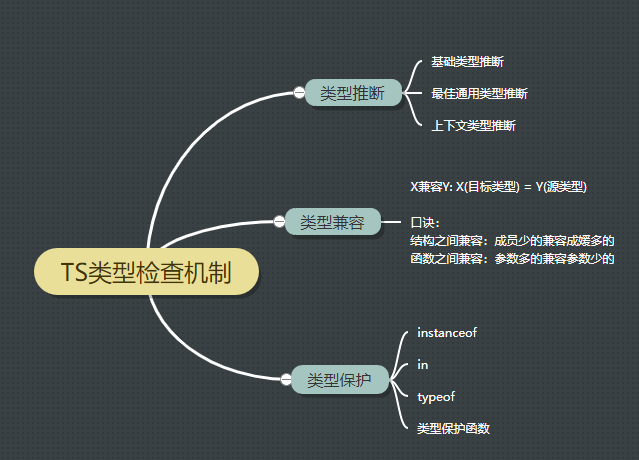

# ts-learn

### note
1. `npm i ts-loader typescript -D`安装ts-loader的时候需要本地安装typescript
2. set strictNullChecks:false for error TS2531: Object is possibly 'null'
3. webpack.config.js里面使用导出函数方式让webpack得到参数并merge
4. add ts check in vscode(有的错误不能抱出来`str = 123`,通过`npm start`查看)
5. data-type、enum、interface(定义对象类型、函数)
6. class idenfier and extends and polymorphism
7. generics and generics约束
8. 类型推断、类型兼容、类型保护
